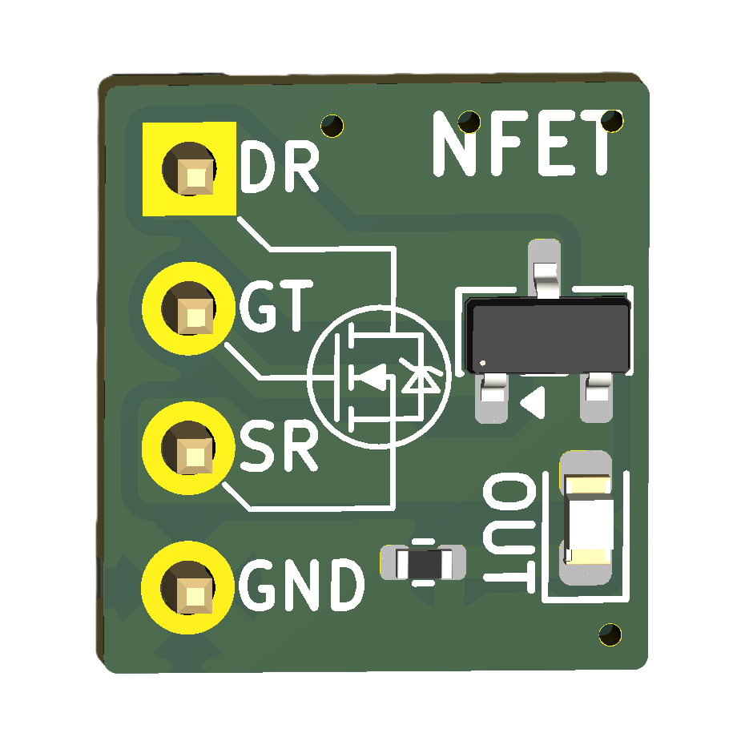
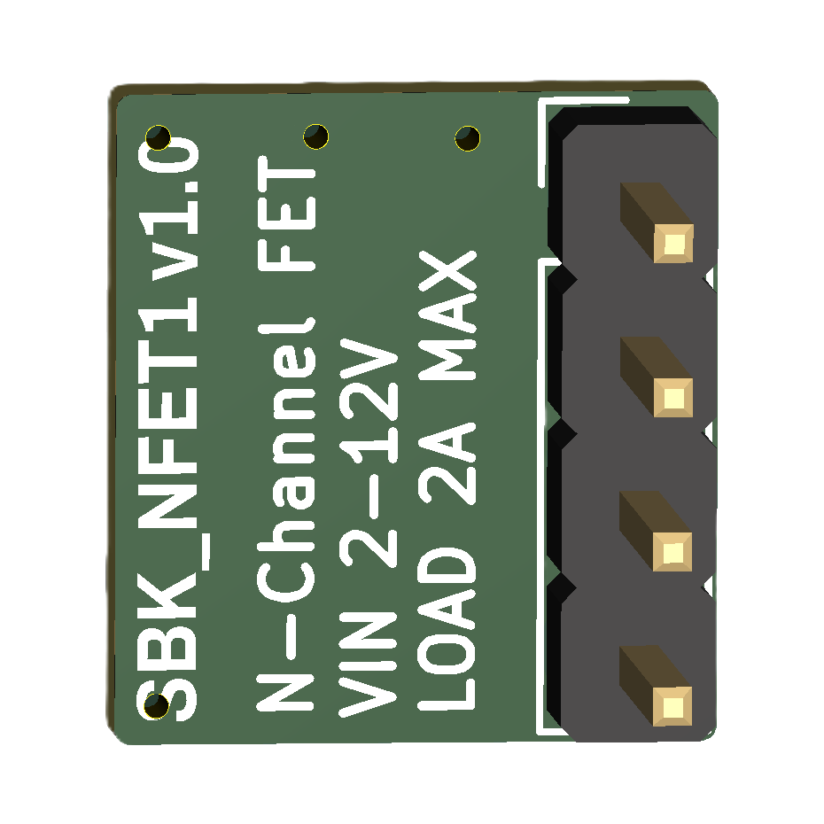
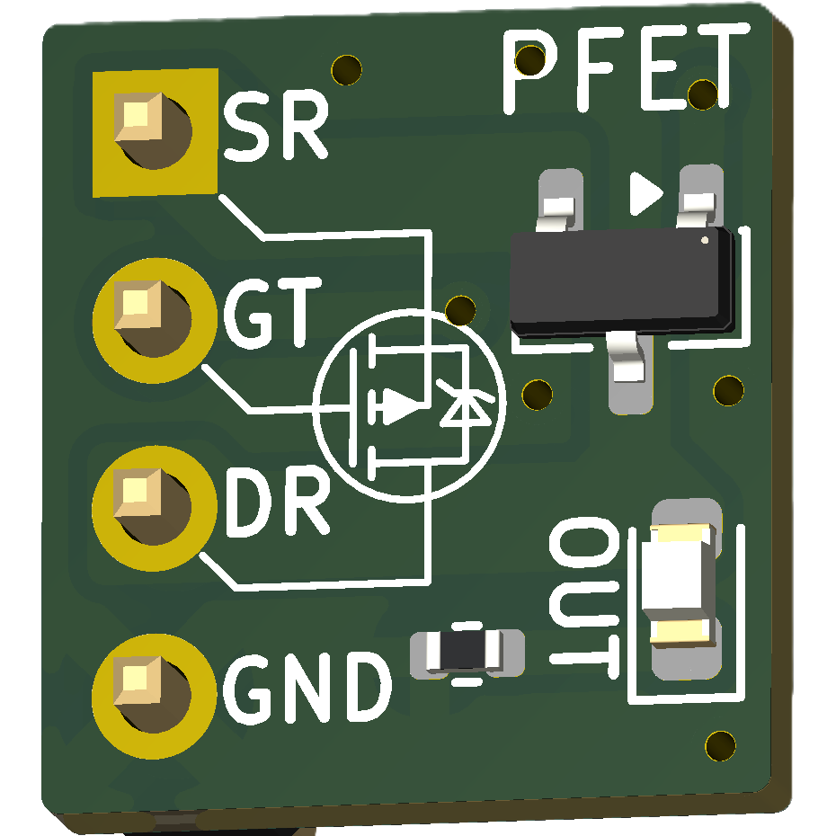
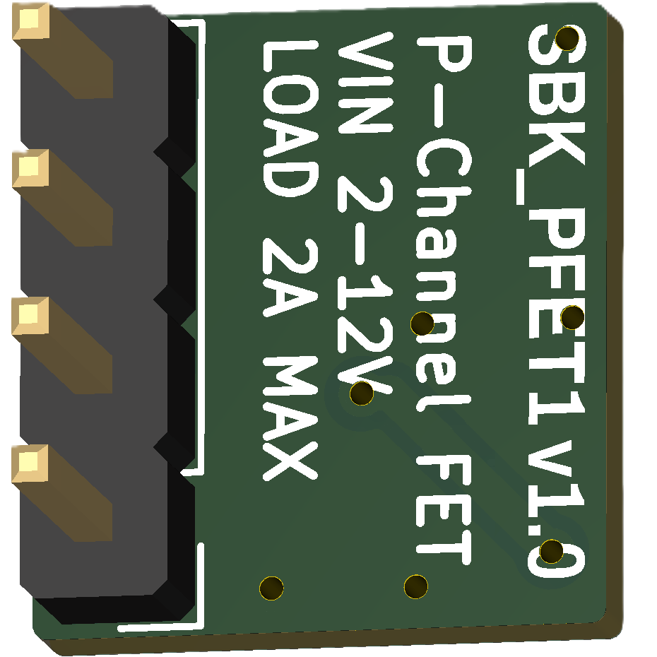

# SBK_FET1 | MOSFET Module

  
  &nbsp;&nbsp;&nbsp;
  

  <b>NFET Front</b> &nbsp;&nbsp;&nbsp;&nbsp;&nbsp;&nbsp;&nbsp;&nbsp;&nbsp;&nbsp;&nbsp;&nbsp;&nbsp;&nbsp;&nbsp;&nbsp;&nbsp;&nbsp;&nbsp;&nbsp;&nbsp;&nbsp;&nbsp;&nbsp;&nbsp;&nbsp;&nbsp;
  <b>NFET Back</b>

  
  &nbsp;&nbsp;&nbsp;
  

  <b>PFET Front</b> &nbsp;&nbsp;&nbsp;&nbsp;&nbsp;&nbsp;&nbsp;&nbsp;&nbsp;&nbsp;&nbsp;&nbsp;&nbsp;&nbsp;&nbsp;&nbsp;&nbsp;&nbsp;&nbsp;&nbsp;&nbsp;&nbsp;&nbsp;&nbsp;&nbsp;&nbsp;&nbsp;
  <b>PFET Back</b>

---

## Open-source MOSFET module for learning and embedded electronics projects.

SBK_FET1 is a compact educational MOSFET module designed for breadboards, prototyping, and learning electronic switching circuits.

The module is available in both **N-channel** and **P-channel** versions and provides clearly labeled **Drain**, **Gate**, and **Source** connections. An optional output voltage indicator LED can be enabled by connecting the **GND** pin or disabled by leaving it unconnected.

---

## Features

- Available in **N-channel** and **P-channel** versions
- Logic-level MOSFET
- Operating voltage: **2–12 VDC**
- Recommended continuous load: **up to 2 A**
- Clearly labeled Drain, Gate, and Source terminals
- Silkscreen MOSFET symbol showing the intrinsic body diode
- Optional output voltage indicator LED
- LED can be disabled by leaving the GND pin unconnected
- Breadboard-friendly 2.54 mm pin header
- Compact educational module for learning MOSFET operation and switching circuits

---

## Pinout

| Pin | Description |
|------|-------------|
| **DR** | Drain |
| **GT** | Gate |
| **SR** | Source |
| **GND** | Optional ground connection for the indicator LED |

> The GND pin is only required for the indicator LED. The MOSFET operates normally without it.

---

## Applications

- LED control
- Relays
- Solenoids
- DC motors
- Low-side switching (N-channel)
- High-side switching (P-channel)
- Logic-controlled loads
- Educational electronics projects
- Breadboard prototyping

---

## Important Notes

- The operating voltage (2–12 V) refers to the switched load voltage.
- The recommended 2 A load rating is based on the module's PCB size and thermal considerations.
- The indicator LED shows that the monitored output node is energized. It does **not** indicate whether the MOSFET is ON or OFF.
- An external flyback diode is required when driving inductive loads such as relays, solenoids, and DC motors.
- Connect the flyback diode across the load, **not** across the MOSFET.

---

## Getting Started

This project is fully open-source hardware. You can:

- Build your own board using the provided KiCad design files.
- Modify the design to suit your application.
- Manufacture your own boards.
- *(Coming soon)* Purchase fully assembled modules from my Tindie store.

👉 **SBK Tindie Store**

https://www.tindie.com/stores/smartbuildskits/

---

## Related Projects

- **SBK_NFET1** — N-Channel MOSFET Module
- **SBK_PFET1** — P-Channel MOSFET Module
- **SBK_RP1** — Reverse Polarity Protection Module
- **MémoBot** — Educational memory game demonstrating the use of SBK hardware modules

---

## License

This project is released as open-source hardware under the **CERN Open Hardware Licence Version 2 - Permissive (CERN-OHL-P v2)**.

You are free to study, modify, manufacture, and distribute this design under the terms of the license.

See the [LICENSE](LICENSE) file for details.

---

## Design Files

Designed using **KiCad 10**.
